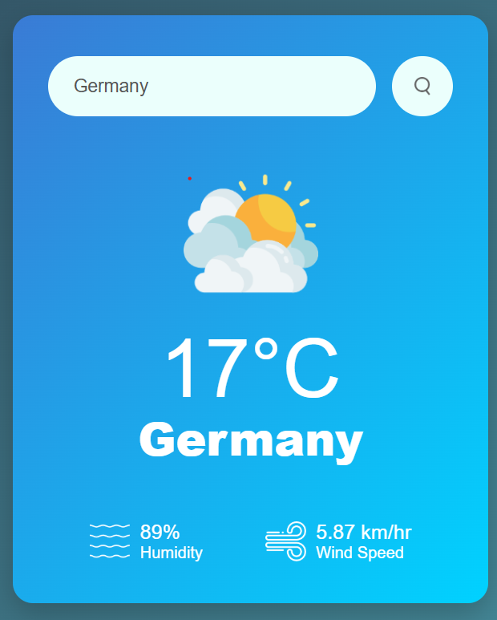

# 🌤️ Weather App

A simple and beautiful weather app that allows users to check real-time weather information by entering any city name. It fetches live data using the OpenWeatherMap API.

 
---

## 🚀 Features

- 🌎 Get current temperature, humidity, and wind speed by city name
- 🧠 Handles invalid city input with error message
- 🌈 Clean and responsive UI with gradient background
- 🖱️ Works with both **search button click** and **Enter key press**
- 📸 Dynamic weather icons based on conditions (Rain, Clear, Clouds, etc.)

---

## 🛠️ Tech Stack

- ✅ HTML5  
- ✅ CSS3  
- ✅ JavaScript (Vanilla)  
- ✅ OpenWeatherMap API

